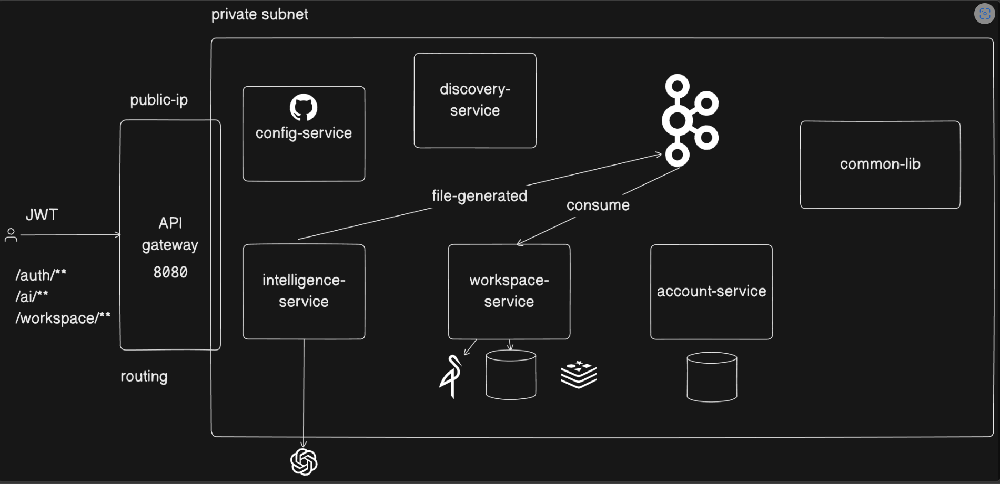

# 1. Microservice Architecture Explained

Think of this architecture like a well-organized restaurant. Instead of having one person do everything (cook, clean,
take orders, manage money), the work is split among specialized workers. This is what a "microservice" architecture
is—splitting a big application into smaller, independent pieces.

Here is a breakdown of the diagram in simple terms:

## 1. The Front Door: API Gateway

When a user wants to use the application, they don't talk to the kitchen directly. They talk to the host at the front
door.

* **API Gateway (Port 8080)**: This is the host. It receives all requests from the outside world.
* **JWT (JSON Web Token)**: Think of this as the user's VIP pass or ID card. The user shows this to the Gateway to prove
  they are allowed inside.
* **Routing**: Depending on what the user wants (e.g., to log in `/auth/`, use AI `/ai/`, or view their files
  `/workspace/`), the Gateway acts like a traffic cop and directs them to the correct department inside.

## 2. The Secure Area: Private Subnet

Everything inside the large box labeled "private subnet" is hidden from the public internet. It's like the restaurant's
kitchen and back office. People from the outside cannot just walk in; they must go through the API Gateway first.

## 3. The Management & Helper Tools

These services don't serve the user directly, but they help the other workers do their jobs.

* **config-service (with the GitHub logo)**: This is the restaurant's master rulebook. It stores all the settings and
  configurations for the other services in one central place.
* **discovery-service**: This is the internal phonebook. Because there are many workers, they use this phonebook to find
  out how to talk to each other.
* **common-lib**: This is a shared toolkit. If multiple workers need the same tool (like a specific piece of code), it's
  kept here so they don't have to build it from scratch twice.

## 4. The Specialized Workers (Services)

These are the departments doing the actual work:

* **account-service**: Handles everything related to user accounts (like saving your password and profile). It has its
  own private filing cabinet (database) at the bottom.
* **intelligence-service**: This handles the "smart" AI features. You can see it reaches out to an external AI brain (
  represented by the ChatGPT logo at the bottom).
* **workspace-service**: Manages the user's workspace, projects, and files. It connects to its own databases to store
  data and files safely.

## 5. How They Communicate: The Messenger (Kafka)

Sometimes, workers need to pass notes to each other without waiting around.

* **The Connected Circles Logo (Kafka)**: This is a fast message board or post office.
* **"file-generated" & "consume"**: When the `intelligence-service` finishes creating an AI file, it doesn't wait to
  hand it directly to the `workspace-service`. Instead, it pins a message on the message board ("file-generated"). The
  `workspace-service` later checks the board, sees the message, and picks it up ("consume") when it's ready. This keeps
  everything running smoothly and quickly without services blocking each other.

### Summary

You come to the front door (API Gateway) with your ID (JWT). The gateway checks what you want and directs your request
into a secure back-room (Private Subnet). Inside, specialized workers (Account, Workspace, Intelligence) handle your
request. They use a phonebook (Discovery) to find each other, a rulebook (Config) for instructions, and a fast message
board (Kafka) to pass tasks along efficiently.

---
# 2. Common Lib explanation
Viewed org.springframework.boot.autoconfigure.AutoConfiguration.imports:1-3
Listed directory common_lib
Listed directory security
Listed directory error
Listed directory dto
Viewed AuthUtil.java:1-58
Viewed JwtAuthFilter.java:1-50
Viewed JwtUserPrincipal.java:1-50
Viewed SharedSecurityAutoConfiguration.java:1-37
Viewed ApiError.java:1-22
Viewed BadRequestException.java:1-14
Viewed ResourceNotFoundException.java:1-17
Viewed GlobalExceptionHandler.java:1-70
Viewed SharedExceptionAutoConfiguration.java:1-13
Viewed UserDto.java:1-9

Here is a detailed breakdown of the files in the `common-lib` project, their purposes, and why they are essential for your **Lovable Distributed Microservices System**.

---

### 1. DTO (Data Transfer Object) Package
Located in [src/main/java/com/example/common_lib/dto/](file:///c:/Users/Pournima%20Thakare/Desktop/SpringBoot/lovable-clone/lovable-microservice-architecture-notes/common-lib/src/main/java/com/example/common_lib/dto/)

*   **[UserDto.java](file:///c:/Users/Pournima%20Thakare/Desktop/SpringBoot/lovable-clone/lovable-microservice-architecture-notes/common-lib/src/main/java/com/example/common_lib/dto/UserDto.java)**
  *   **What it is:** A Java record representing user details (`id`, `userName`, `name`).
  *   **Why we need it:** Distributed systems communicate across services. Having a standardized DTO in the shared library ensures all services (e.g. Auth Service, Order Service, Notification Service) represent user metadata in exactly the same way when transferring payload data.

---

### 2. Security Package
Located in [src/main/java/com/example/common_lib/security/](file:///c:/Users/Pournima%20Thakare/Desktop/SpringBoot/lovable-clone/lovable-microservice-architecture-notes/common-lib/src/main/java/com/example/common_lib/security/)

*   **[AuthUtil.java](file:///c:/Users/Pournima%20Thakare/Desktop/SpringBoot/lovable-clone/lovable-microservice-architecture-notes/common-lib/src/main/java/com/example/common_lib/security/AuthUtil.java)**
  *   **What it is:** A helper utility responsible for signing (generating) JWT access tokens and parsing/verifying incoming JWT tokens. It also provides a utility method (`getCurrentUserId()`) to fetch the authenticated user's ID directly from the Spring Security context.
  *   **Why we need it:** Centralizes the cryptographic JWT signing and verification logic. If you decide to change token expiration time or key settings, you only have to edit it here rather than in every microservice.
*   **[JwtAuthFilter.java](file:///c:/Users/Pournima%20Thakare/Desktop/SpringBoot/lovable-clone/lovable-microservice-architecture-notes/common-lib/src/main/java/com/example/common_lib/security/JwtAuthFilter.java)**
  *   **What it is:** A custom HTTP servlet filter that intercepts every incoming request, extracts the `Bearer <token>` from the `Authorization` header, validates it using `AuthUtil`, and registers the authenticated user in Spring Security's context.
  *   **Why we need it:** Secures endpoints inside each microservice. Without this, each microservice would have to duplicate security filter chains and configuration setups.
*   **[JwtUserPrincipal.java](file:///c:/Users/Pournima%20Thakare/Desktop/SpringBoot/lovable-clone/lovable-microservice-architecture-notes/common-lib/src/main/java/com/example/common_lib/security/JwtUserPrincipal.java)**
  *   **What it is:** An implementation of Spring Security's `UserDetails` contract.
  *   **Why we need it:** Bridges your custom JWT user details with Spring Security. It enables controllers to easily extract user details using annotations like `@AuthenticationPrincipal`.
*   **[SharedSecurityAutoConfiguration.java](file:///c:/Users/Pournima%20Thakare/Desktop/SpringBoot/lovable-clone/lovable-microservice-architecture-notes/common-lib/src/main/java/com/example/common_lib/security/SharedSecurityAutoConfiguration.java)**
  *   **What it is:** A Spring autoconfiguration class that sets up the security beans. Crucially, it registers a **Feign `RequestInterceptor`**.
  *   **Why we need it (Token Relay):** In a microservices architecture, when a user calls Service A (e.g., Gateway/Order Service), and Service A needs to fetch data from Service B (e.g., Inventory Service), the user's security context must flow to Service B. The Feign `RequestInterceptor` automatically intercepts outgoing Feign client HTTP calls, extracts the user's JWT from the security context, and appends it to the header of the outgoing request.

---

### 3. Error Package
Located in [src/main/java/com/example/common_lib/error/](file:///c:/Users/Pournima%20Thakare/Desktop/SpringBoot/lovable-clone/lovable-microservice-architecture-notes/common-lib/src/main/java/com/example/common_lib/error/)

*   **[ApiError.java](file:///c:/Users/Pournima%20Thakare/Desktop/SpringBoot/lovable-clone/lovable-microservice-architecture-notes/common-lib/src/main/java/com/example/common_lib/error/ApiError.java)**
  *   **What it is:** A record that standardizes the JSON response structure for errors (contains HTTP status, timestamp, global error message, and validation field-level details).
  *   **Why we need it:** Ensures clients (like a React or mobile frontend) receive a uniform, clean error payload regardless of which backend microservice threw the exception.
*   **[BadRequestException.java](file:///c:/Users/Pournima%20Thakare/Desktop/SpringBoot/lovable-clone/lovable-microservice-architecture-notes/common-lib/src/main/java/com/example/common_lib/error/BadRequestException.java) & [ResourceNotFoundException.java](file:///c:/Users/Pournima%20Thakare/Desktop/SpringBoot/lovable-clone/lovable-microservice-architecture-notes/common-lib/src/main/java/com/example/common_lib/error/ResourceNotFoundException.java)**
  *   **What it is:** Standard custom runtime exceptions mapping to HTTP status `400 Bad Request` and `404 Not Found`.
  *   **Why we need it:** Promotes clean, expressive error-handling across all business logic without manual HTTP status management.
*   **[GlobalExceptionHandler.java](file:///c:/Users/Pournima%20Thakare/Desktop/SpringBoot/lovable-clone/lovable-microservice-architecture-notes/common-lib/src/main/java/com/example/common_lib/error/GlobalExceptionHandler.java)**
  *   **What it is:** A `@RestControllerAdvice` class that catches thrown exceptions (e.g. `ExpiredJwtException`, validation failures, or resource-not-found exceptions) and formats them into the standard `ApiError` JSON response.
  *   **Why we need it:** Centralizes exception mapping and prevents services from returning raw stack traces to users, improving security and consistency.
*   **[SharedExceptionAutoConfiguration.java](file:///c:/Users/Pournima%20Thakare/Desktop/SpringBoot/lovable-clone/lovable-microservice-architecture-notes/common-lib/src/main/java/com/example/common_lib/error/SharedExceptionAutoConfiguration.java)**
  *   **What it is:** Automatically registers the `GlobalExceptionHandler` bean in the application context.

---

### 4. Configuration Bootstrapping
Located in [src/main/resources/META-INF/spring/](file:///c:/Users/Pournima%20Thakare/Desktop/SpringBoot/lovable-clone/lovable-microservice-architecture-notes/common-lib/src/main/resources/META-INF/spring/)

*   **[org.springframework.boot.autoconfigure.AutoConfiguration.imports](file:///c:/Users/Pournima%20Thakare/Desktop/SpringBoot/lovable-clone/lovable-microservice-architecture-notes/common-lib/src/main/resources/META-INF/spring/org.springframework.boot.autoconfigure.AutoConfiguration.imports)**
  *   **What it is:** Tells Spring Boot to scan and load `SharedSecurityAutoConfiguration` and `SharedExceptionAutoConfiguration` whenever this JAR dependency is imported.
  *   **Why we need it:** Makes the library "plug-and-play." Developers do not need to annotate microservices with `@ComponentScan` or `@Import` to enable security and exception handling.

---

### Summary of Benefits for the "Lovable" Microservice System:
1.  **DRY (Don't Repeat Yourself)**: Avoids duplicating security configuration, JWT validation logic, and error handlers across multiple microservices.
2.  **Security Token Relay**: Integrates Feign Client interceptors directly with Spring Security to pass authorization context cleanly across network boundaries.
3.  **Unified API Contracts**: Unifies JSON data models for error handling and user data structures across all downstream services.
