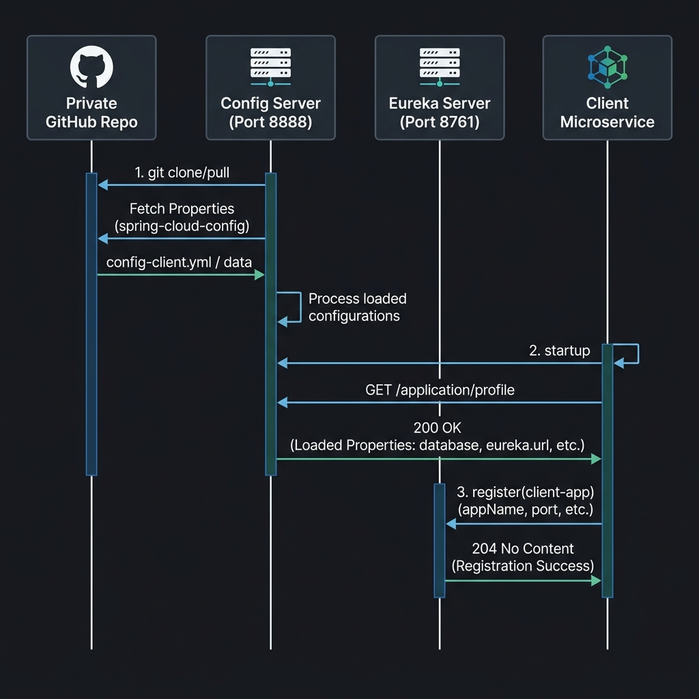

# 1. Microservice Architecture Explained


Think of this architecture like a well-organized restaurant. Instead of having one person do everything (cook, clean,
take orders, manage money), the work is split among specialized workers. This is what a "microservice" architecture
is—splitting a big application into smaller, independent pieces.

Here is a breakdown of the diagram in simple terms:

## 1. The Front Door: API Gateway

When a user wants to use the application, they don't talk to the kitchen directly. They talk to the host at the front
door.

* **API Gateway (Port 8080)**: This is the host. It receives all requests from the outside world.
* **JWT (JSON Web Token)**: Think of this as the user's VIP pass or ID card. The user shows this to the Gateway to prove
  they are allowed inside.
* **Routing**: Depending on what the user wants (e.g., to log in `/auth/`, use AI `/ai/`, or view their files
  `/workspace/`), the Gateway acts like a traffic cop and directs them to the correct department inside.

## 2. The Secure Area: Private Subnet

Everything inside the large box labeled "private subnet" is hidden from the public internet. It's like the restaurant's
kitchen and back office. People from the outside cannot just walk in; they must go through the API Gateway first.

## 3. The Management & Helper Tools

These services don't serve the user directly, but they help the other workers do their jobs.

* **config-service (with the GitHub logo)**: This is the restaurant's master rulebook. It stores all the settings and
  configurations for the other services in one central place.
* **discovery-service**: This is the internal phonebook. Because there are many workers, they use this phonebook to find
  out how to talk to each other.
* **common-lib**: This is a shared toolkit. If multiple workers need the same tool (like a specific piece of code), it's
  kept here so they don't have to build it from scratch twice.

## 4. The Specialized Workers (Services)

These are the departments doing the actual work:

* **account-service**: Handles everything related to user accounts (like saving your password and profile). It has its
  own private filing cabinet (database) at the bottom.
* **intelligence-service**: This handles the "smart" AI features. You can see it reaches out to an external AI brain (
  represented by the ChatGPT logo at the bottom).
* **workspace-service**: Manages the user's workspace, projects, and files. It connects to its own databases to store
  data and files safely.

## 5. How They Communicate: The Messenger (Kafka)

Sometimes, workers need to pass notes to each other without waiting around.

* **The Connected Circles Logo (Kafka)**: This is a fast message board or post office.
* **"file-generated" & "consume"**: When the `intelligence-service` finishes creating an AI file, it doesn't wait to
  hand it directly to the `workspace-service`. Instead, it pins a message on the message board ("file-generated"). The
  `workspace-service` later checks the board, sees the message, and picks it up ("consume") when it's ready. This keeps
  everything running smoothly and quickly without services blocking each other.

### Summary

You come to the front door (API Gateway) with your ID (JWT). The gateway checks what you want and directs your request
into a secure back-room (Private Subnet). Inside, specialized workers (Account, Workspace, Intelligence) handle your
request. They use a phonebook (Discovery) to find each other, a rulebook (Config) for instructions, and a fast message
board (Kafka) to pass tasks along efficiently.

---
# 2. Common Lib explanation
Viewed org.springframework.boot.autoconfigure.AutoConfiguration.imports:1-3
Listed directory common_lib
Listed directory security
Listed directory error
Listed directory dto
Viewed AuthUtil.java:1-58
Viewed JwtAuthFilter.java:1-50
Viewed JwtUserPrincipal.java:1-50
Viewed SharedSecurityAutoConfiguration.java:1-37
Viewed ApiError.java:1-22
Viewed BadRequestException.java:1-14
Viewed ResourceNotFoundException.java:1-17
Viewed GlobalExceptionHandler.java:1-70
Viewed SharedExceptionAutoConfiguration.java:1-13
Viewed UserDto.java:1-9

Here is a detailed breakdown of the files in the `common-lib` project, their purposes, and why they are essential for your **Lovable Distributed Microservices System**.

---

### 1. DTO (Data Transfer Object) Package
Located in [src/main/java/com/example/common_lib/dto/](file:///c:/Users/Pournima%20Thakare/Desktop/SpringBoot/lovable-clone/lovable-microservice-architecture-notes/common-lib/src/main/java/com/example/common_lib/dto/)

*   **[UserDto.java](file:///c:/Users/Pournima%20Thakare/Desktop/SpringBoot/lovable-clone/lovable-microservice-architecture-notes/common-lib/src/main/java/com/example/common_lib/dto/UserDto.java)**
  *   **What it is:** A Java record representing user details (`id`, `userName`, `name`).
  *   **Why we need it:** Distributed systems communicate across services. Having a standardized DTO in the shared library ensures all services (e.g. Auth Service, Order Service, Notification Service) represent user metadata in exactly the same way when transferring payload data.

---

### 2. Security Package
Located in [src/main/java/com/example/common_lib/security/](file:///c:/Users/Pournima%20Thakare/Desktop/SpringBoot/lovable-clone/lovable-microservice-architecture-notes/common-lib/src/main/java/com/example/common_lib/security/)

*   **[AuthUtil.java](file:///c:/Users/Pournima%20Thakare/Desktop/SpringBoot/lovable-clone/lovable-microservice-architecture-notes/common-lib/src/main/java/com/example/common_lib/security/AuthUtil.java)**
  *   **What it is:** A helper utility responsible for signing (generating) JWT access tokens and parsing/verifying incoming JWT tokens. It also provides a utility method (`getCurrentUserId()`) to fetch the authenticated user's ID directly from the Spring Security context.
  *   **Why we need it:** Centralizes the cryptographic JWT signing and verification logic. If you decide to change token expiration time or key settings, you only have to edit it here rather than in every microservice.
*   **[JwtAuthFilter.java](file:///c:/Users/Pournima%20Thakare/Desktop/SpringBoot/lovable-clone/lovable-microservice-architecture-notes/common-lib/src/main/java/com/example/common_lib/security/JwtAuthFilter.java)**
  *   **What it is:** A custom HTTP servlet filter that intercepts every incoming request, extracts the `Bearer <token>` from the `Authorization` header, validates it using `AuthUtil`, and registers the authenticated user in Spring Security's context.
  *   **Why we need it:** Secures endpoints inside each microservice. Without this, each microservice would have to duplicate security filter chains and configuration setups.
*   **[JwtUserPrincipal.java](file:///c:/Users/Pournima%20Thakare/Desktop/SpringBoot/lovable-clone/lovable-microservice-architecture-notes/common-lib/src/main/java/com/example/common_lib/security/JwtUserPrincipal.java)**
  *   **What it is:** An implementation of Spring Security's `UserDetails` contract.
  *   **Why we need it:** Bridges your custom JWT user details with Spring Security. It enables controllers to easily extract user details using annotations like `@AuthenticationPrincipal`.
*   **[SharedSecurityAutoConfiguration.java](file:///c:/Users/Pournima%20Thakare/Desktop/SpringBoot/lovable-clone/lovable-microservice-architecture-notes/common-lib/src/main/java/com/example/common_lib/security/SharedSecurityAutoConfiguration.java)**
  *   **What it is:** A Spring autoconfiguration class that sets up the security beans. Crucially, it registers a **Feign `RequestInterceptor`**.
  *   **Why we need it (Token Relay):** In a microservices architecture, when a user calls Service A (e.g., Gateway/Order Service), and Service A needs to fetch data from Service B (e.g., Inventory Service), the user's security context must flow to Service B. The Feign `RequestInterceptor` automatically intercepts outgoing Feign client HTTP calls, extracts the user's JWT from the security context, and appends it to the header of the outgoing request.

---

### 3. Error Package
Located in [src/main/java/com/example/common_lib/error/](file:///c:/Users/Pournima%20Thakare/Desktop/SpringBoot/lovable-clone/lovable-microservice-architecture-notes/common-lib/src/main/java/com/example/common_lib/error/)

*   **[ApiError.java](file:///c:/Users/Pournima%20Thakare/Desktop/SpringBoot/lovable-clone/lovable-microservice-architecture-notes/common-lib/src/main/java/com/example/common_lib/error/ApiError.java)**
  *   **What it is:** A record that standardizes the JSON response structure for errors (contains HTTP status, timestamp, global error message, and validation field-level details).
  *   **Why we need it:** Ensures clients (like a React or mobile frontend) receive a uniform, clean error payload regardless of which backend microservice threw the exception.
*   **[BadRequestException.java](file:///c:/Users/Pournima%20Thakare/Desktop/SpringBoot/lovable-clone/lovable-microservice-architecture-notes/common-lib/src/main/java/com/example/common_lib/error/BadRequestException.java) & [ResourceNotFoundException.java](file:///c:/Users/Pournima%20Thakare/Desktop/SpringBoot/lovable-clone/lovable-microservice-architecture-notes/common-lib/src/main/java/com/example/common_lib/error/ResourceNotFoundException.java)**
  *   **What it is:** Standard custom runtime exceptions mapping to HTTP status `400 Bad Request` and `404 Not Found`.
  *   **Why we need it:** Promotes clean, expressive error-handling across all business logic without manual HTTP status management.
*   **[GlobalExceptionHandler.java](file:///c:/Users/Pournima%20Thakare/Desktop/SpringBoot/lovable-clone/lovable-microservice-architecture-notes/common-lib/src/main/java/com/example/common_lib/error/GlobalExceptionHandler.java)**
  *   **What it is:** A `@RestControllerAdvice` class that catches thrown exceptions (e.g. `ExpiredJwtException`, validation failures, or resource-not-found exceptions) and formats them into the standard `ApiError` JSON response.
  *   **Why we need it:** Centralizes exception mapping and prevents services from returning raw stack traces to users, improving security and consistency.
*   **[SharedExceptionAutoConfiguration.java](file:///c:/Users/Pournima%20Thakare/Desktop/SpringBoot/lovable-clone/lovable-microservice-architecture-notes/common-lib/src/main/java/com/example/common_lib/error/SharedExceptionAutoConfiguration.java)**
  *   **What it is:** Automatically registers the `GlobalExceptionHandler` bean in the application context.

---

### 4. Configuration Bootstrapping
Located in [src/main/resources/META-INF/spring/](file:///c:/Users/Pournima%20Thakare/Desktop/SpringBoot/lovable-clone/lovable-microservice-architecture-notes/common-lib/src/main/resources/META-INF/spring/)

*   **[org.springframework.boot.autoconfigure.AutoConfiguration.imports](file:///c:/Users/Pournima%20Thakare/Desktop/SpringBoot/lovable-clone/lovable-microservice-architecture-notes/common-lib/src/main/resources/META-INF/spring/org.springframework.boot.autoconfigure.AutoConfiguration.imports)**
  *   **What it is:** Tells Spring Boot to scan and load `SharedSecurityAutoConfiguration` and `SharedExceptionAutoConfiguration` whenever this JAR dependency is imported.
  *   **Why we need it:** Makes the library "plug-and-play." Developers do not need to annotate microservices with `@ComponentScan` or `@Import` to enable security and exception handling.

---

### Summary of Benefits for the "Lovable" Microservice System:
1.  **DRY (Don't Repeat Yourself)**: Avoids duplicating security configuration, JWT validation logic, and error handlers across multiple microservices.
2.  **Security Token Relay**: Integrates Feign Client interceptors directly with Spring Security to pass authorization context cleanly across network boundaries.
3.  **Unified API Contracts**: Unifies JSON data models for error handling and user data structures across all downstream services.

---

# 3. Config Server & Discovery Server Setup

In this section, we cover the setup and integration of two foundational infrastructure services in our microservices cluster: **Spring Cloud Config Server** (for centralized configuration management) and **Netflix Eureka Discovery Server** (for service registry and discovery).

---

## 3.1. Centralized Configuration Management

### 1. GitHub Private Repository & Personal Access Token (PAT)
* **What we did:** Created a private Git repository (`lovable-config-server`) to store our microservices configuration files (`.yaml`/`.properties`), generated a GitHub Personal Access Token (PAT) with read permissions, and configured the Config Server to access it.
* **Why we did it:** 
  * **Centralization:** Storing all application configurations in a single place allows us to manage environment-specific properties (e.g., development, staging, production) without having to redeploy or rebuild the microservice applications when settings change.
  * **Security:** A *private* repository ensures credentials (like database passwords, Kafka server configurations, and API keys) are secure and not exposed to the public.
  * **Authentication:** The GitHub *PAT* is required for our local Spring Cloud Config Server to safely authenticate and pull configuration files from the private repository.

### 2. Spring Cloud Config Server Setup ([config-service](file:///c:/Users/Pournima%20Thakare/Desktop/SpringBoot/lovable-clone/lovable-microservice-architecture-notes/config-service))
* **What we did:**
  * Enabled the configuration server by adding `@EnableConfigServer` to [ConfigServiceApplication.java](file:///c:/Users/Pournima%20Thakare/Desktop/SpringBoot/lovable-clone/lovable-microservice-architecture-notes/config-service/src/main/java/com/example/config_service/ConfigServiceApplication.java).
  * Configured [application.yaml](file:///c:/Users/Pournima%20Thakare/Desktop/SpringBoot/lovable-clone/lovable-microservice-architecture-notes/config-service/src/main/resources/application.yaml) with the Git repository details, including the URI, username, default-label (branch name `main`), and the PAT as the password.
* **Why we did it:**
  * `@EnableConfigServer` marks the application as a Spring Cloud Config Server, unlocking the endpoints required for client microservices to request their configuration at startup.
  * The `application.yaml` connection setup tells the service exactly where to fetch the files from and provides the authentication credentials to bypass GitHub's private repository access restrictions.

---

## 3.2. Service Registry & Discovery

### 1. Netflix Eureka Server Setup ([discovery-service](file:///c:/Users/Pournima%20Thakare/Desktop/SpringBoot/lovable-clone/lovable-microservice-architecture-notes/discovery-service))
* **What we did:**
  * Enabled Eureka Server capabilities by adding `@EnableEurekaServer` to [DiscoveryServiceApplication.java](file:///c:/Users/Pournima%20Thakare/Desktop/SpringBoot/lovable-clone/lovable-microservice-architecture-notes/discovery-service/src/main/java/com/example/discovery_service/DiscoveryServiceApplication.java).
  * Configured [application.yaml](file:///c:/Users/Pournima%20Thakare/Desktop/SpringBoot/lovable-clone/lovable-microservice-architecture-notes/discovery-service/src/main/resources/application.yaml) with the registry-specific options:
    ```yaml
    eureka:
      client:
        register-with-eureka: false
        fetch-registry: false
    ```
* **Why we did it:**
  * **Dynamic Directory (Eureka Server):** Rather than hardcoding IP addresses and ports for each microservice, microservices register themselves dynamically with Eureka upon startup. They also consult Eureka to find where other microservices are running.
  * **Disable Self-Registration & Fetching:** Since this application *is* the Eureka Server itself, it does not need to register with itself (`register-with-eureka: false`), nor does it need to fetch/cache the registry from a peer server (`fetch-registry: false`). This prevents the server from logging unnecessary connection/registration errors trying to find itself.

---

## 3.3. Configuration Fetching Flow (Config-First vs. Discovery-First)

Here is a detailed breakdown of how your microservices retrieve configuration and register themselves in this setup.

### Config-First Flow (Current Implementation)

By default, we configure the client microservices using `spring.config.import` referencing the Config Server URL directly:

```yaml
spring:
  config:
    import: "optional:configserver:http://localhost:8888"
```

In this setup:
1. **Config Server Initialization**: The `config-service` (on Port 8888) clones the config files from the private GitHub repository (`lovable-config-server`).
2. **Direct Config Retrieval**: When a microservice starts, it connects directly to `http://localhost:8888` via HTTP to retrieve its configuration properties. At this stage, it does *not* consult the Eureka Discovery Server.
3. **Eureka Registration**: One of the properties fetched from the Config Server is the Eureka Service URL (`eureka.client.service-url.defaultZone`). The microservice then uses this URL to register itself with the Discovery Server on Port 8761.




### Alternative: Discovery-First Flow

If you want the microservices to find the Config Server dynamically via Eureka instead of using a hardcoded URL:
1. You would set `spring.cloud.config.discovery.enabled: true` in the client.
2. The client would first contact Eureka on startup to resolve the host and port of the `config-service`.
3. The client would then pull its configuration from the resolved Config Server instance.

*Note: The Config-First flow is standard, simpler to debug, and faster for local development.*

---

# 4. Intelligence Service Detailed Overview

The **Intelligence Service** acts as the AI engine of the Lovable-clone platform. It bridges the gap between the web applications and Large Language Models (LLMs) via the **Spring AI** framework. It handles streaming chat generation, context-enrichment (injecting file trees), LLM tools execution, response parsing into transactional events, and daily token budget enforcement.

---

## 4.1. Key Architectural Patterns & Features

### 1. Spring AI Integration & SSE Streaming
* **File Reference:** [ChatController.java](file:///c:/Users/Pournima%20Thakare/Desktop/SpringBoot/lovable-clone/lovable-microservice-architecture-notes/intelligence-service/src/main/java/com/example/intelligence_service/controller/ChatController.java) & [AiGenerationServiceImpl.java](file:///c:/Users/Pournima%20Thakare/Desktop/SpringBoot/lovable-clone/lovable-microservice-architecture-notes/intelligence-service/src/main/java/com/example/intelligence_service/service/impl/AiGenerationServiceImpl.java)
* **What it is:** The service uses Spring AI's fluent `ChatClient` API to communicate with LLM endpoints (configured via `spring-ai-starter-model-openai` in `pom.xml`). It streams tokens back in real-time as Server-Sent Events (SSE) using WebFlux's `Flux<ServerSentEvent<StreamResponse>>`.
* **Why we need it:** Generative AI responses take time. Streaming ensures the UI is responsive, printing letters one-by-one instead of blocking the client thread for 10–30 seconds.

### 2. Context Enrichment (File-Tree Advisor)
* **File Reference:** [FileTreeContextAdvisor.java](file:///c:/Users/Pournima%20Thakare/Desktop/SpringBoot/lovable-clone/lovable-microservice-architecture-notes/intelligence-service/src/main/java/com/example/intelligence_service/llm/advisors/FileTreeContextAdvisor.java)
* **What it is:** A Spring AI `StreamAdvisor` that intercepts requests before sending them to the LLM. It queries the `workspace-service` via a Feign Client to get the project's file structure and appends a `SystemMessage` detailing the `---- FILE_TREE ----` context.
* **Why we need it:** The AI model needs to know the layout of the project it is modifying. Feeding the file tree context dynamically allows the AI to reference existing directories and create or modify files in the correct locations.

### 3. Function Calling / LLM Tools
* **File Reference:** [CodeGenerationTools.java](file:///c:/Users/Pournima%20Thakare/Desktop/SpringBoot/lovable-clone/lovable-microservice-architecture-notes/intelligence-service/src/main/java/com/example/intelligence_service/llm/tools/CodeGenerationTools.java)
* **What it is:** Java-defined helper methods decorated with `@Tool` and `@ToolParam` annotations from Spring AI. The primary tool is `read_files`, which accepts a list of file paths and returns the actual contents from the workspace.
* **Why we need it:** Instead of stuffing the entire codebase's contents into a massive system prompt (which is expensive and hits token limits), the AI calls this tool selectively to read specific files only when it needs them.

### 4. XML-Based Streaming Response Parser
* **File Reference:** [LlmResponseParser.java](file:///c:/Users/Pournima%20Thakare/Desktop/SpringBoot/lovable-clone/lovable-microservice-architecture-notes/intelligence-service/src/main/java/com/example/intelligence_service/llm/LlmResponseParser.java) & [PromptUtils.java](file:///c:/Users/Pournima%20Thakare/Desktop/SpringBoot/lovable-clone/lovable-microservice-architecture-notes/intelligence-service/src/main/java/com/example/intelligence_service/llm/PromptUtils.java)
* **What it is:** The AI model is strictly instructed (via system prompts in `PromptUtils`) to structure all responses in custom XML-like wrapper tags:
  * `<message phase="planning|completed">...</message>` for conversational notes and actions.
  * `<tool args="path1,path2">...</tool>` to log tools execution.
  * `<file path="...">...</file>` containing complete, non-placeholder code additions or modifications.
* The `LlmResponseParser` uses regular expressions to extract these segments, mapping them to structured database events (`ChatEventType` enum: `THOUGHT`, `MESSAGE`, `FILE_EDIT`, `TOOL_LOG`).
* **Why we need it:** By isolating the code content inside `<file>` blocks, the backend can extract code changes programmatically and issue saving commands directly to the Workspace storage without extracting markdown text manually.

### 5. Seamless Token Relay and Multi-Threading Context
* **File Reference:** [IntelligenceServiceApplication.java](file:///c:/Users/Pournima%20Thakare/Desktop/SpringBoot/lovable-clone/lovable-microservice-architecture-notes/intelligence-service/src/main/java/com/example/intelligence_service/IntelligenceServiceApplication.java)
* **What it is:** App boot sets `SecurityContextHolder.setStrategyName(SecurityContextHolder.MODE_INHERITABLETHREADLOCAL)`.
* **Why we need it:** In reactive and asynchronous setups (e.g., SSE streaming running tasks in background threads or scheduling finalization routines), child threads must inherit the Security context (JWT) of the parent request. Without this, Feign clients (`WorkspaceClient`, `AccountClient`) interceptors in downstream threads would throw `401 Unauthorized` errors.

### 6. Daily Usage and Subscription Limits
* **File Reference:** [UsageServiceImpl.java](file:///c:/Users/Pournima%20Thakare/Desktop/SpringBoot/lovable-clone/lovable-microservice-architecture-notes/intelligence-service/src/main/java/com/example/intelligence_service/service/impl/UsageServiceImpl.java)
* **What it is:** Enforces usage quotas. Before triggering an AI generation call, the system retrieves user subscription settings from `account-service` and checks the daily token log. If `unlimitedAi` is false and the daily token counts exceed `maxTokensPerDay`, it throws HTTP `429 TOO_MANY_REQUESTS`.
* **Why we need it:** Protects backend computational and API resources from abuse or overruns, monetizing resources through Tier-based access.

---

## 4.2. Database Entity Relationships

The service keeps track of chat context, messages, events, and token usage limits.

### 1. Entity: `chat_sessions` (Table: `chat_sessions`)
Tracks active AI conversation sessions scoped to a user and project composite key.

| Column Name | Data Type | Key Type | Description |
| :--- | :--- | :--- | :--- |
| `project_id` | `BIGINT` | `PK` (Composite), `FK` | The ID of the project in `workspace-service`. |
| `user_id` | `BIGINT` | `PK` (Composite), `FK` | The ID of the user in `account-service`. |
| `created_at` | `TIMESTAMP` | — | Date/time when the session was initialized. |
| `updated_at` | `TIMESTAMP` | — | Date/time of the last message update. |
| `deleted_at` | `TIMESTAMP` | — | Soft-delete timestamp (nullable). |

### 2. Entity: `chat_messages` (Table: `chat_messages`)
Stores individual message prompts from the user and generation answers from the assistant.

| Column Name | Data Type | Key Type | Description |
| :--- | :--- | :--- | :--- |
| `id` | `BIGINT` (Identity) | `PK` | Unique identifier for each message. |
| `project_id` | `BIGINT` | `FK` | Part of the composite key pointing to `chat_sessions`. |
| `user_id` | `BIGINT` | `FK` | Part of the composite key pointing to `chat_sessions`. |
| `role` | `VARCHAR` | — | Role of the sender: `USER` or `ASSISTANT`. |
| `content` | `TEXT` | — | Raw text of the user's prompt (null for assistant if split into events). |
| `tokens_used` | `INTEGER` | — | Number of LLM tokens consumed by this message. |
| `created_at` | `TIMESTAMP` | — | Timestamp when the message was recorded. |

### 3. Entity: `chat_events` (Table: `chat_events`)
Splits the assistant's complex streaming response into structured event-based records.

| Column Name | Data Type | Key Type | Description |
| :--- | :--- | :--- | :--- |
| `id` | `BIGINT` (Identity) | `PK` | Unique event identifier. |
| `chat_message_id` | `BIGINT` | `FK` | Foreign key referencing the parent message in `chat_messages`. |
| `sequence_order`| `INTEGER` | — | The sequential order of the event block in the response (starts at 0). |
| `content` | `TEXT` | — | Content payload (e.g., chat paragraph or generated file content). |
| `chat_event_type`| `VARCHAR` | — | Event type enum: `THOUGHT`, `MESSAGE`, `FILE_EDIT`, `TOOL_LOG`. |
| `file_path` | `VARCHAR` | — | Target path for the file modification (only valid for `FILE_EDIT`). |
| `metadata` | `TEXT` | — | Raw arguments metadata log (only valid for `TOOL_LOG`). |

### 4. Entity: `usage_logs` (Table: `usage_logs`)
Enforces and monitors daily token usage limits per user.

| Column Name | Data Type | Key Type | Description |
| :--- | :--- | :--- | :--- |
| `id` | `BIGINT` (Identity) | `PK` | Unique record identifier. |
| `user_id` | `BIGINT` | — | The ID of the authenticated user. |
| `date` | `DATE` | — | The date of the token log. |
| `tokens_used` | `INTEGER` | — | Cumulative number of AI tokens consumed on this date. |

> [!NOTE]
> A unique constraint is placed on `(user_id, date)` to ensure there is exactly one log record per user per day.


1. **[ChatSession](file:///c:/Users/Pournima%20Thakare/Desktop/SpringBoot/lovable-clone/lovable-microservice-architecture-notes/intelligence-service/src/main/java/com/example/intelligence_service/entity/ChatSession.java)**: Represents a chat session scoped to a user and project composite key.
2. **[ChatMessage](file:///c:/Users/Pournima%20Thakare/Desktop/SpringBoot/lovable-clone/lovable-microservice-architecture-notes/intelligence-service/src/main/java/com/example/intelligence_service/entity/ChatMessage.java)**: Captures individual message transactions. If the role is `USER`, content is standard text. If it is `ASSISTANT`, content is generated by the LLM.
3. **[ChatEvent](file:///c:/Users/Pournima%20Thakare/Desktop/SpringBoot/lovable-clone/lovable-microservice-architecture-notes/intelligence-service/src/main/java/com/example/intelligence_service/entity/ChatEvent.java)**: Splits assistant responses into multiple granular events (e.g., thoughts, message paragraphs, tool logs, file edits).
4. **[UsageLog](file:///c:/Users/Pournima%20Thakare/Desktop/SpringBoot/lovable-clone/lovable-microservice-architecture-notes/intelligence-service/src/main/java/com/example/intelligence_service/entity/UsageLog.java)**: Tracks cumulative AI token usage for each user on a daily basis.

---

## 4.3. Exposed Endpoints & Feign Clients

### REST API Endpoints
* **`POST /api/chat/stream`**: Accepts `ChatRequest` containing a message and `projectId`, and returns `Flux<ServerSentEvent<StreamResponse>>`.
* **`GET /api/chat/projects/{projectId}`**: Fetches the persistent history of conversations for the given project.
* **`GET /api/usage/today`**: Endpoint to check today's token usage.

### OpenFeign Integrations
* **[WorkspaceClient](file:///c:/Users/Pournima%20Thakare/Desktop/SpringBoot/lovable-clone/lovable-microservice-architecture-notes/intelligence-service/src/main/java/com/example/intelligence_service/client/WorkspaceClient.java)**:
  * `/workspace/api/projects/{projectId}/files` (Retrieve file tree layout)
  * `/workspace/api/projects/{projectId}/files/content` (Read specific file content)
  * `/workspace/api/projects/{projectId}/files` (Write/Save file content back to storage)
* **[AccountClient](file:///c:/Users/Pournima%20Thakare/Desktop/SpringBoot/lovable-clone/lovable-microservice-architecture-notes/intelligence-service/src/main/java/com/example/intelligence_service/client/AccountClient.java)**:
  * `/account/internal/v1/users/{id}` (Get user profile metadata)
  * `/account/api/users/{userId}/subscription` (Verify tier subscription quotas and limitations)

---

## 4.4. Cross-Microservice Code Flow

The following sequence diagram and explanation detail how a user's AI prompt flows through the system, illustrating exactly **why** and **when** the `intelligence-service` communicates with other microservices.

```
[React UI Client] 
       │ 
       ▼ (1) POST /api/chat/stream (JWT Bearer Token + Request Body)
[API Gateway (8080)]
       │
       ▼ (2) Route request (with JWT Token Relay)
[Intelligence Service (8083)]
       │
       ├─► (3) Feign: getSubscription(userId) ──► [Account Service (8081)]
       │                                                │
       │   ◄── (4) Return subscription tier ◄───────────┘
       │
       ├─► (5) Feign: getProject(projectId) ───► [Workspace Service (8082)]
       │                                                │
       │   ◄── (6) Return Project Summary ◄─────────────┘
       │
       ├─► (7) Feign: getFileTree(projectId) ──► [Workspace Service (8082)]
       │                                                │
       │   ◄── (8) Return file tree layout ◄────────────┘
       │
       ├─► (9) Stream prompt (Context + Tools) ─► [OpenAI / LLM Model]
       │                                                │
       │   ◄── (10) SSE text tokens ◄───────────────────┤
       │                                                │
       │   [Optional LLM Tool Calling Phase]            │
       │   ◄── (11) read_files(pathList) ◄──────────────┤
       │   ──► (12) getFileContent(path) ──► [Workspace Service]
       │   ◄── (13) Return file content ◄─── [Workspace Service]
       │   ──► (14) Return tool result ──► [OpenAI / LLM Model]
       │
       ├─► (15) SSE stream (StreamResponse) ───► [React UI Client]
       │
       └─► (16) Feign: saveFile(path, code) ───► [Workspace Service (8082)]
```

### Execution Lifecycle Phases

#### Phase 1: Authentication & Daily Quota Check
* **Steps 1-2:** The user initiates a code generation request. The API Gateway intercepts the request and relays the JWT access token to the **Intelligence Service**.
* **Steps 3-4:** The service extracts the `userId` from the JWT context and queries the **Account Service** via OpenFeign (`AccountClient.getSubscription(userId)`) to fetch subscription status (e.g. check the `unlimitedAi` flag or daily `maxTokensPerDay` limit).
* It verifies whether the daily usage logs in the local PostgreSQL database (`usage_logs`) have exceeded this limit. If so, it immediately blocks request execution by throwing `429 TOO_MANY_REQUESTS`.

#### Phase 2: Session & Project Validation
* **Steps 5-6:** The service queries the **Workspace Service** (`WorkspaceClient.getProject(projectId)`) to ensure the target project exists and belongs to the authenticated user.
* It then calls `AccountClient.getUser(userId)` to fetch profile details and creates/retrieves the active `ChatSession` in the local DB.

#### Phase 3: Prompt & Context Enrichment (Advisors)
* **Steps 7-8:** Before calling the model, `FileTreeContextAdvisor` intercepts the execution chain. It calls **Workspace Service** (`WorkspaceClient.getFileTree(projectId)`) to pull the full project layout.
* It embeds the file structure (`---- FILE_TREE ----`) into the system prompt message before sending it to the model.

#### Phase 4: Streaming LLM Prompt Execution
* **Steps 9-10:** The service submits the compiled prompt, system prompt, context files list, and LLM tools description to the external **LLM Model**.
* The LLM streams text tokens chunk-by-chunk back to the **Intelligence Service**, which forwards it to the **React Client** in real-time as Server-Sent Events (SSE).
* **Steps 11-14 (Optional Tool Call):** If the LLM needs to read specific files, it invokes the `read_files` function call tool. The service intercepts the action, calls **Workspace Service** (`WorkspaceClient.getFileContent(projectId, path)`) to retrieve file contents, and feeds it back to the LLM to resume generation.

#### Phase 5: Finalization & Workspace Modification (Asynchronous)
* **Steps 15-16:** Once the stream completes, the service asynchronously runs finalization:
  * The `LlmResponseParser` extracts changes wrapped in custom `<file path="...">` tags.
  * For each file change, the service calls `WorkspaceClient.saveFile(...)` to write updates directly to the project's workspace repository (persisted in MinIO).
  * Stores the user prompt and assistant response in the database (`chat_messages` & `chat_events`) and records token usages in `usage_logs`.

### Detailed Breakdown of Interactions:

#### 1. Why `intelligence-service` calls `account-service`
* **Validation & Security:** When the user initiates a request, the `intelligence-service` calls `/api/users/{userId}/subscription` and `/internal/v1/users/{id}` using OpenFeign. This verifies that the user profile actually exists.
* **Enforcing Quotas & Tiers:** It queries the user's specific tier configuration (such as checking the `unlimitedAi` flag or retrieving the `maxTokensPerDay` threshold). Comparing this limit against local database daily logs (`usage_logs`) enables token budgeting *before* initiating costly external model prompts.

#### 2. Why `intelligence-service` calls `workspace-service`
* **Ownership Verification:** Confirms that the target project (`projectId`) is registered and exists in the system via `/api/projects/{projectId}`.
* **Dynamic Context Loading (Advisors):** Queries the workspace structure using `/api/projects/{projectId}/files` to get the list of active files. The advisor maps this file tree into the prompt instructions so the LLM has deep contextual awareness of the file architecture it is operating in.
* **On-Demand File Reading (Tools):** If the LLM requests changes to a file but doesn't know its contents, it invokes the `read_files` function call tool. This requests the code text via `/api/projects/{projectId}/files/content` on the fly.
* **Saving Generated Code:** The XML parser extracts generated code blocks within `<file path="...">` tags. The service then invokes `/api/projects/{projectId}/files` (`saveFile` request) to write the code adjustments back to the project files (persisted by workspace storage).

---

# 5. Account Service Detailed Overview

The **Account Service** acts as the user management, authentication, billing, and subscription engine of the Lovable-clone platform. It securely registers and authenticates users, manages subscription tiers, enforces resource limits (e.g., project and AI token limits), and integrates with **Stripe** to handle online payments and customer portals.

---

## 5.1. Key Architectural Patterns & Features

### 1. Stripe Subscription & Payment Management
* **File Reference:** [StripePaymentProcessor.java](file:///c:/Users/Pournima%20Thakare/Desktop/SpringBoot/lovable-clone/lovable-microservice-architecture-notes/account-service/src/main/java/com/example/account_service/services/impl/StripePaymentProcessor.java)
* **What it is:** The service integrates the official Stripe SDK to manage billing. When a user requests a purchase, the service creates a Stripe customer mapping (generating a `stripeCustomerId` in PostgreSQL if it doesn't exist) and builds a Stripe Checkout Session (`SessionCreateParams`) returning a Stripe checkout page URL.
* **Why we need it:** Delegating card payments and PCI-compliance to Stripe keeps our system secure and simplifies global subscription charges.

### 2. Stripe Customer Billing Portal
* **File Reference:** [BillingController.java](file:///c:/Users/Pournima%20Thakare/Desktop/SpringBoot/lovable-clone/lovable-microservice-architecture-notes/account-service/src/main/java/com/example/account_service/controller/BillingController.java) & [StripePaymentProcessor.java](file:///c:/Users/Pournima%20Thakare/Desktop/SpringBoot/lovable-clone/lovable-microservice-architecture-notes/account-service/src/main/java/com/example/account_service/services/impl/StripePaymentProcessor.java)
* **What it is:** Generates a secure, self-service customer portal link. Users are redirected to Stripe's hosted portal where they can cancel plans, view payment history, update billing details, and switch tiers.
* **Why we need it:** Saves developer time by avoiding building profile-management views and billing dashboards, delegating invoice history and cancellations to Stripe's UI.

### 3. Stripe Webhook Verification & Lifecycle Management
* **File Reference:** [BillingController.java](file:///c:/Users/Pournima%20Thakare/Desktop/SpringBoot/lovable-clone/lovable-microservice-architecture-notes/account-service/src/main/java/com/example/account_service/controller/BillingController.java) (Method: `handlePaymentWebHooks`)
* **What it is:** Exposes `/webhooks/payment` which intercepts real-time payment notifications sent from Stripe's servers. Webhooks verify signatures cryptographically using the `webhookSecret` before updating databases.
* It handles these key events:
  * `checkout.session.completed`: Calls `activateSubscription()` to provision subscription records.
  * `customer.subscription.updated`: Upgrades/downgrades user plan tiers and shifts billing boundaries.
  * `customer.subscription.deleted`: Revokes user privileges and flags the plan as cancelled.
  * `invoice.paid` / `invoice.payment_failed`: Renews or marks subscriptions as past-due.

### 4. Authentication, BCrypt Encryption & JWT Token Issuance
* **File Reference:** [AuthController.java](file:///c:/Users/Pournima%20Thakare/Desktop/SpringBoot/lovable-clone/lovable-microservice-architecture-notes/account-service/src/main/java/com/example/account_service/controller/AuthController.java), [AuthServiceImpl.java](file:///c:/Users/Pournima%20Thakare/Desktop/SpringBoot/lovable-clone/lovable-microservice-architecture-notes/account-service/src/main/java/com/example/account_service/services/impl/AuthServiceImpl.java), & [AccountSecurityConfig.java](file:///c:/Users/Pournima%20Thakare/Desktop/SpringBoot/lovable-clone/lovable-microservice-architecture-notes/account-service/src/main/java/com/example/account_service/security/AccountSecurityConfig.java)
* **What it is:** User accounts are registered via `/auth/signup` and logged in via `/auth/login`. Password storage utilizes BCrypt hashing to guarantee raw password safety. Upon verification, the service uses `AuthUtil` to package user claims into a JWT access token returned to the client.

---

## 5.2. Database Entity Relationships

The service persists user accounts, plans, pricing limits, active subscription records, and token limits.

### 1. Entity: `users` (Table: `users`)
Stores user profiles and credentials.

| Column Name | Data Type | Key Type | Description |
| :--- | :--- | :--- | :--- |
| `id` | `BIGINT` (Identity) | `PK` | Unique user identifier. |
| `username` | `VARCHAR` | Unique | Email address / login credential. |
| `password` | `VARCHAR` | — | Encrypted hash of user's password. |
| `name` | `VARCHAR` | — | Display name of the user. |
| `stripe_customer_id` | `VARCHAR` | Unique | Linked ID in Stripe's database. |
| `created_at` | `TIMESTAMP` | — | Signup timestamp. |
| `updated_at` | `TIMESTAMP` | — | Details modification timestamp. |
| `deleted_at` | `TIMESTAMP` | — | Nullable soft-delete timestamp. |

### 2. Entity: `plan` (Table: `plan`)
Defines product tiers and limits.

| Column Name | Data Type | Key Type | Description |
| :--- | :--- | :--- | :--- |
| `id` | `BIGINT` (Identity) | `PK` | Plan identifier. |
| `name` | `VARCHAR` | — | Name of the plan (e.g. Free, Pro). |
| `stripe_price_id` | `VARCHAR` | Unique | Product/price ID mapped in Stripe. |
| `max_projects` | `INTEGER` | — | Project creation threshold for this plan. |
| `max_tokens_per_day` | `INTEGER` | — | Daily token cap for LLM generations. |
| `max_previews` | `INTEGER` | — | Allowed deployment/previews count. |
| `unlimited_ai` | `BOOLEAN` | — | Flag enabling unlimited AI without tokens limit. |
| `active` | `BOOLEAN` | — | Flag showing if the plan is available for checkout. |

### 3. Entity: `subscription` (Table: `subscription`)
Maps users to their active plan limits.

| Column Name | Data Type | Key Type | Description |
| :--- | :--- | :--- | :--- |
| `id` | `BIGINT` (Identity) | `PK` | Subscription identifier. |
| `user_id` | `BIGINT` | `FK` | Links to user in `users`. |
| `plan_id` | `BIGINT` | `FK` | Links to pricing tier in `plan`. |
| `stripe_subscription_id` | `VARCHAR` | Unique | Stripe subscription identifier. |
| `status` | `VARCHAR` | — | Mapped state: `ACTIVE`, `PAST_DUE`, `CANCELLED`, `TRIALING`, etc. |
| `current_period_start` | `TIMESTAMP` | — | Active billing cycle start timestamp. |
| `current_period_end` | `TIMESTAMP` | — | Active billing cycle expiration timestamp. |
| `cancel_period_end` | `BOOLEAN` | — | If true, plan ends instead of renewing. |
| `created_at` | `TIMESTAMP` | — | Provision timestamp. |
| `updated_at` | `TIMESTAMP` | — | Modification timestamp. |

---

## 5.3. Exposed Endpoints

### REST API Endpoints (Public/Client Facing)
* **`POST /auth/signup`**: Registers a new user account (takes email, password, name) and returns a signed JWT.
* **`POST /auth/login`**: Authenticates user credentials (username, password) and returns a signed JWT.
* **`GET /api/plans`**: Returns a list of all active pricing plans.
* **`GET /api/me/subscriptions`**: Queries the subscription object for the currently authenticated user.
* **`POST /api/payments/checkout`**: Generates a Stripe Checkout session redirect link based on chosen `planId`.
* **`POST /api/payments/portal`**: Generates a Stripe Customer Portal redirect link to self-manage subscriptions.
* **`POST /webhooks/payment`**: Receives Stripe webhook events for automated database updates.

### Internal Microservice API Endpoints (`/internal/v1`)
These endpoints bypass normal client security rules to allow cross-microservice calls (e.g. from `intelligence-service` or `workspace-service`):
* **`GET /internal/v1/users/{id}`**: Returns `UserDto` (contains user id, name, and email) to verify user existence.
* **`GET /internal/v1/users/by-email`**: Look up user profile by email query parameter.
* **`GET /internal/v1/billing/current-plan`**: Returns current billing plan limits (`PlanDto`) for the authenticated user context.

---

## 5.4. Cross-Microservice Payment Flow

The following step-by-step flowchart describes the billing activation lifecycle and demonstrates how Stripe checkout flows through the backend:

```
[React Client App]
       │
       ▼ (1) Choose Plan & Click "Subscribe" (JWT auth header)
[API Gateway (8080)]
       │
       ▼ (2) Route to /api/payments/checkout
[Account Service (8081)]
       │
       ├─► (3) Query PostgreSQL to check if User has stripeCustomerId
       │       │
       │       ├─► No: Call Stripe Customer API to create new customer
       │       └─► Yes: Reuse existing stripeCustomerId
       │
       ├─► (4) Create Stripe Checkout Session (Set mode=subscription, priceId)
       │
       ◄── (5) Return checkout url to client ◄───────────────────┐
       │                                                         │
[React Client App]                                               │
       │                                                         │
       ▼ (6) Redirect client browser to Stripe Checkout          │
[Stripe Checkout Page (stripe.com)]                              │
       │                                                         │
       ▼ (7) User enters credit card and completes payment       │
[Stripe Billing Engine]                                          │
       │                                                         │
       ├─► (8) Send async notification: checkout.session.completed ┘
       │
       ▼ (9) POST webhook event with Stripe signature header
[Account Service /webhooks/payment]
       │
       ├─► (10) Webhook signature validation (using webhookSecret)
       │
       └─► (11) Activate subscription in DB (create Subscription, status = ACTIVE)
```

---

# 6. Workspace Service Detailed Overview

The **Workspace Service** manages projects, file hierarchies, workspace collaborator memberships, and triggers deployment previews. It saves file data to **MinIO Object Storage** and boots running code instances dynamically using a **Kubernetes Pod Pool** and a **Redis-based reverse proxy**.

---

## 6.1. Key Architectural Patterns & Features

### 1. Subscription-Aware Project Quotas
* **File Reference:** [ProjectServiceImpl.java](file:///c:/Users/Pournima%20Thakare/Desktop/SpringBoot/lovable-clone/lovable-microservice-architecture-notes/workspace-service/src/main/java/com/example/workspace_service/service/impl/ProjectServiceImpl.java)
* **What it is:** When creating a project, the service calls **Account Service** via OpenFeign (`AccountClient.getCurrentSubscribedPlanByUser()`) to fetch the user's active billing limit (`plan.maxProjects()`). If the count of owned projects exceeds the quota, it blocks creation with a custom exception.
* **Why we need it:** Prevents resource abuse on the free tier and monetizes the system by requiring users to upgrade for additional workspaces.

### 2. File Storage with MinIO Object Storage
* **File Reference:** [ProjectFileServiceImpl.java](file:///c:/Users/Pournima%20Thakare/Desktop/SpringBoot/lovable-clone/lovable-microservice-architecture-notes/workspace-service/src/main/java/com/example/workspace_service/service/impl/ProjectFileServiceImpl.java)
* **What it is:** Code files generated or modified by users (or LLMs) are uploaded directly to a MinIO S3-compatible bucket (default: `projects`). Files are saved with object keys structured as `{projectId}/{filePath}`. Postgres only stores lightweight file metadata (paths and timestamps) in the `project_files` table.
* **Why we need it:** Offloading file content from PostgreSQL to MinIO avoids database bloat from storing large text files and matches cloud-native distributed architecture.

### 3. Kubernetes Hot-Deployment Preview Engine
* **File Reference:** [KubernetesDeploymentServiceImpl.java](file:///c:/Users/Pournima%20Thakare/Desktop/SpringBoot/lovable-clone/lovable-microservice-architecture-notes/workspace-service/src/main/java/com/example/workspace_service/service/impl/KubernetesDeploymentServiceImpl.java)
* **What it is:** A containerized hot-reloading execution engine:
  * **Idle Runner Pool:** Maintains pre-warmed, running Kubernetes pods in the namespace `lovable-dev` labeled `status=idle`.
  * **Dynamic Allocation:** Triggering a deploy selects an idle runner pod and edits its labels to `status=busy` and `project-id={projectId}`.
  * **MinIO Syncer Watcher:** Inside the pod's `syncer` container, it executes `mc mirror --watch` to copy project files from MinIO to the pod's `/app` workspace. Any changes saved to MinIO are automatically synced to the pod in real-time.
  * **Vite Dev Server:** The `runner` container executes `npm install && npm run dev` to serve the app on port 5173.
  * **Redis Dynamic Route Registration:** Resolves the pod IP and maps the domain `project-{projectId}.127.0.0.1.nip.io` to `podIp:5173` in a shared **Redis cache** (6-hour TTL). A reverse proxy routes incoming browser traffic based on these Redis mapping entries.

---

## 6.2. Database Entity Relationships

The service persists projects, file trees, and workspace collaboration permissions.

### 1. Entity: `projects` (Table: `projects`)
Stores workspace projects metadata.

| Column Name | Data Type | Key Type | Description |
| :--- | :--- | :--- | :--- |
| `id` | `BIGINT` (Identity) | `PK` | Unique project identifier. |
| `name` | `VARCHAR` | — | Project workspace name. |
| `is_public` | `BOOLEAN` | — | Visibility status. |
| `created_at` | `TIMESTAMP` | — | Creation timestamp. |
| `updated_at` | `TIMESTAMP` | — | Last modification timestamp. |
| `deleted_at` | `TIMESTAMP` | — | Nullable soft-delete timestamp. |

### 2. Entity: `project_files` (Table: `project_files`)
Tracks files metadata. The file content itself is saved in MinIO.

| Column Name | Data Type | Key Type | Description |
| :--- | :--- | :--- | :--- |
| `id` | `BIGINT` (Identity) | `PK` | Unique file metadata record identifier. |
| `project_id` | `BIGINT` | `FK` | Links to project in `projects`. |
| `path` | `VARCHAR` | — | Relative workspace path (e.g. `src/App.tsx`). |
| `minio_object_key` | `VARCHAR` | — | MinIO S3 object key identifier: `{projectId}/{path}`. |
| `created_at` | `TIMESTAMP` | — | Creation timestamp. |
| `updated_at` | `TIMESTAMP` | — | Modification timestamp. |

### 3. Entity: `project_members` (Table: `project_members`)
Handles collaborator roles and access control.

| Column Name | Data Type | Key Type | Description |
| :--- | :--- | :--- | :--- |
| `project_id` | `BIGINT` | `PK` (Composite), `FK` | Linked project identifier. |
| `user_id` | `BIGINT` | `PK` (Composite) | Mapped user ID from `account-service`. |
| `project_role` | `VARCHAR` | — | Member role: `OWNER`, `COLLABORATOR`, or `VIEWER`. |
| `invited_at` | `TIMESTAMP` | — | Invitation dispatch timestamp. |
| `accepted_at` | `TIMESTAMP` | — | Invitation acceptance timestamp. |

---

## 6.3. Exposed Endpoints

### Projects REST API (`/api/projects`)
* **`GET /api/projects`**: Fetches all projects where the current user is a member.
* **`GET /api/projects/{id}`**: Returns details of a specific project (requires view permissions).
* **`POST /api/projects`**: Validates limits and creates a new project, setting role as `OWNER`.
* **`PATCH /api/projects/{id}`**: Modifies project configuration (requires edit permissions).
* **`DELETE /api/projects/{id}`**: Soft-deletes a project workspace (requires delete permissions).
* **`POST /api/projects/{id}/deploy`**: Triggers hot-deployment on Kubernetes runners and returns the dynamic nipp.io URL.

### Files REST API (`/api/projects/{projectId}/files`)
* **`GET /api/projects/{projectId}/files`**: Generates a recursive tree map representation of workspace files.
* **`GET /api/projects/{projectId}/files/content?path={path}`**: Retrieves file content from MinIO.
* **`POST /api/projects/{projectId}/files`**: Writes file content updates to MinIO and saves database metadata.

### Project Members REST API (`/api/projects/{projectId}/members`)
* **`GET /api/projects/{projectId}/members`**: Lists all active members and collaborators.
* **`POST /api/projects/{projectId}/members`**: Invites a collaborator by email.
* **`PATCH /api/projects/{projectId}/members/{memberId}`**: Modifies roles of a member (e.g. Collaborator to Viewer).
* **`DELETE /api/projects/{projectId}/members/{memberId}`**: Removes access for a collaborator.

---

## 6.4. Cross-Microservice Hot-Deployment Flow

The following step-by-step flowchart describes how projects are dynamically deployed into running container environments:

```
[React Client App]
       │
       ▼ (1) Click "Deploy Preview" (JWT auth header)
[API Gateway (8080)]
       │
       ▼ (2) Route to /api/projects/{id}/deploy
[Workspace Service (8082)]
       │
       ├─► (3) Check if busy pod already exists for project
       │       │
       │       ├─► Yes: Skip allocation, register route, return URL
       │       └─► No: Claim first idle pod from Kubernetes namespace: lovable-dev
       │
       ├─► (4) Edit labels on claimed Pod: status=busy, project-id={projectId}
       │
       ├─► (5) Exec Command (syncer container): mc mirror --overwrite minio -> /app
       │
       ├─► (6) Exec Command (syncer container): mc mirror --watch minio -> /app & (bg)
       │
       ├─► (7) Exec Command (runner container): npm install && npm run dev & (bg)
       │
       ├─► (8) Resolve Pod IP from Kubernetes Pod resource details
       │
       ├─► (9) Redis: Set "route:project-{id}.127.0.0.1.nip.io" -> "podIp:5173" (TTL 6H)
       │
       ◄── (10) Return Deploy URL (http://project-{id}.127.0.0.1.nip.io:8090)
```


